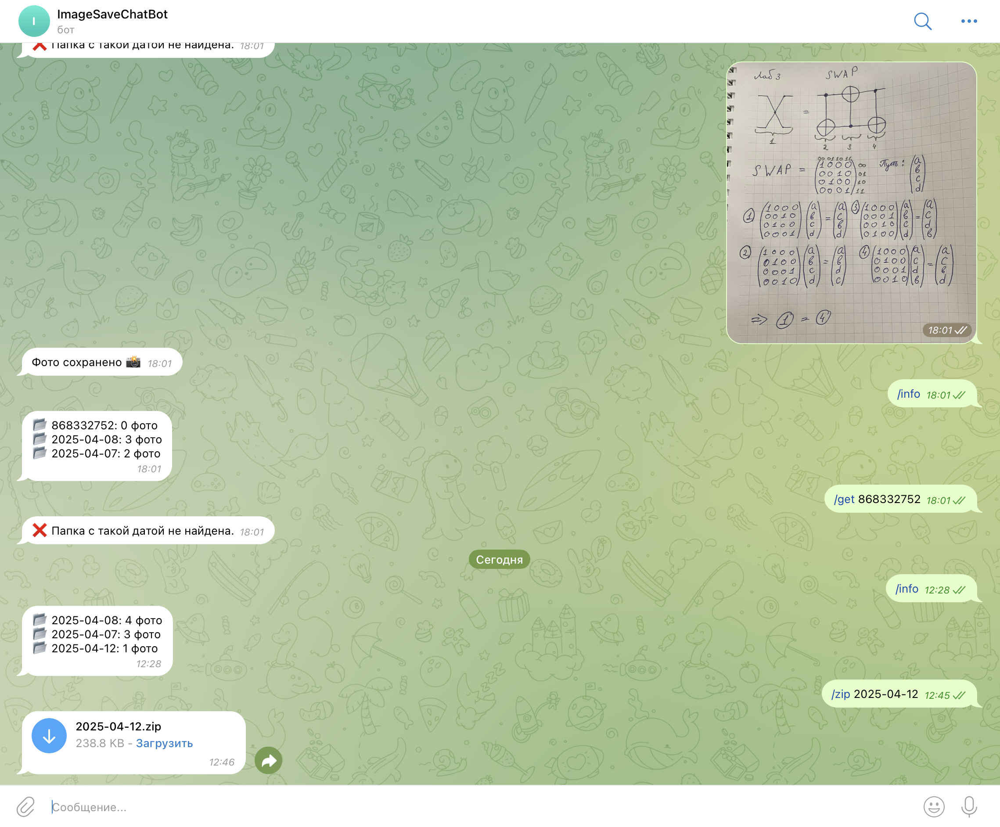
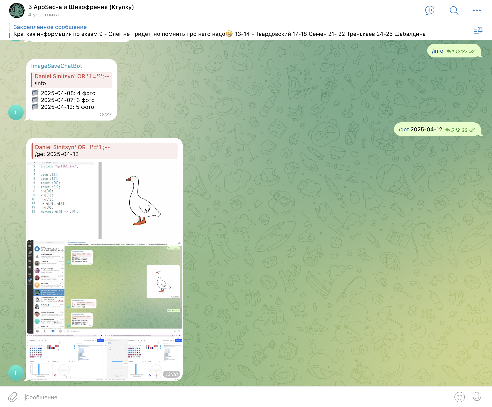

# Бот воспоминаний 
Данный бот предназначен для одной цели чтобы больше не приходилось после путешествия или тусовок сидеть и часами доставать фотографии из разных чатов. 

Теперь вы поднимаете этого бота у себя и просите друзей кидать фото не в ваш личный чатик , а ему. Бот формирует папку с вашими фото за конкретный день (когда ему были отправлены фото). И может выгружать их в сжатом формате. 

Или добавляете бота в чатик и он берёт инфу от туда.

`Убедись, что у бота включено разрешение на работу в группах в настройках у BotFather (/setprivacy ➜ Disable)`
### Бонус
бонусом можно настроить синхронизацию с (Google, Yandex итд...)диском через крон на тачке где поднят бот

## Как запустить?
Создаём файл .env на основе .env.example 
Дальше `make` и всё